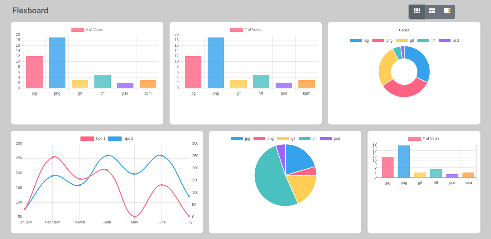
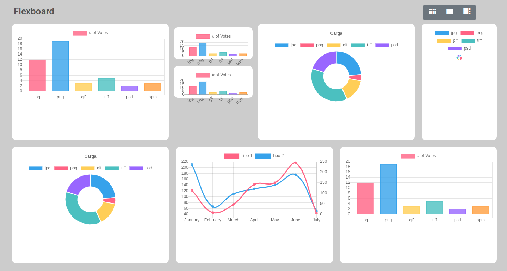

# Flexboard

Dynamic grid layout generator component for Angular environments.

**How so?** Flexboard lets you generate different grid configurations on the fly via JSON input (more on that below).

## Demo

### Simple grid structure



## Installation

Simply adding it as a node dependency by runnning:

```bash
npm install --save ngx-flexboard
```

## Building and testing

This project includes Flexboard library and a simple app you can use for testing purposes. 

First, clone this repo:

```bash
git clone https://github.com/luisrowley/flexboard
```

Navigate to the project's folder:

```bash
cd flexboard
```

Run `ng build ngx-flexboard --watch` to build the library and listen for changes. The build artifacts will be stored in the `dist/` directory. Use the `--prod` flag for a production build.

For testing in the sample app environment, open a separate terminal and navigate to the sample app folder:

```bash
cd flexboard/projects/ngx-flexboard-app
```

Then run:

```bash
npm run start
```

In browser, go to `http://localhost:4200/` as usual.

## Sample layout configuration

You can easily define an array of `rows` with its corresponding columns or `tiles`. Each row element can host multiple tiles as per the following example:

```typescript
const unevenLayout = {
    "title": "uneven",
    "rows": [
      {
        "rowspan": 1,
        "tiles": [
          {
            "colspan": 4,
            "size": "lg",
          },
          {
            "colspan": 4,
            "size": "md",
          },
          {
            "colspan": 4,
            "size": "md",
          }
        ]
      },
      {
        "rowspan": 1,
        "tiles": [
          {
            "colspan": 5,
            "size": "md",
          },
          {
            "colspan": 4,
            "size": "md",
          },
          {
            "colspan": 3,
            "size": "md",
          }
        ]
      },
      {
        "rowspan": 1,
        "tiles": [
          {
            "colspan": 3,
            "size": "md",
          },
          {
            "colspan": 3,
            "size": "md",
          },
          {
            "colspan": 6,
            "size": "md",
          }
        ]
      }
    ]
};
```

For more complex scenarios in which you need a more irregular grid structure, you can use `rowspan` and `colspan` for stretching rows or columns as you see fit.


## Nested tile configuration



This schema allows you to also create nested rows if needed. For this setup you would need to add a nested `"rows"` array inside a `tile` element:

```typescript
const nestedLayout = {
    "title": "nested",
    "rows": [
        {
        "rowspan": 1,
        "tiles": [
            {
            "colspan": 4,
            "size": "md",
            },
            {
            "colspan": 2,
            "size": "lg",
            "rows": [
                {
                "rowspan": 1,
                "tiles": [
                    {
                    "colspan": 12,
                    "size": "md",
                    }
                ]
                },
                {
                "rowspan": 1,
                "tiles": [
                    {
                    "colspan": 12,
                    "size": "md",
                    }
                ]
                }
            ]
            },
            {
            "colspan": 4,
            "size": "md",
            },
            {
            "colspan": 2,
            "size": "md",
            }
            ]
        },
        {
        "rowspan": 1,
        "tiles": [
            {
            "colspan": 4,
            "size": "md",
            },
            {
            "colspan": 4,
            "size": "md",
            },
            {
            "colspan": 4,
            "size": "md",
            }
            ]
        }
    ]
};
```

## Tile item configuration

Flexboard allows you to dynamically load a selection of predefined components in each tile.

These come in the form of an array of type `TileItemDescriptor` with the structure:

```typescript
interface TileItemDescriptor {
    className: string;
    data?: any;
}
```

With the first propery being the component `class name` and second the optional `input data` for the component.

The following would be a sample configuration:

```typescript
const TILE_ITEMS = [
{className: "ChartDefaultComponent", data: {type: 'bar'}},
{className: "ChartDefaultComponent", data: {type: 'pie'}},
{className: "ChartDefaultComponent", data: {type: 'doughnut'}},
{className: "ChartDefaultComponent", data: {type: 'lines'}},
{className: "ChartDefaultComponent", data: {type: 'pie'}},
{className: "ChartDefaultComponent", data: {type: 'bar'}},
{className: "ChartDefaultComponent", data: {type: 'pie'}},
{className: "ChartDefaultComponent", data: {type: 'bar'}},
{className: "ChartDefaultComponent", data: {type: 'pie'}}
]
```

## Running unit tests

Run `ng test` to execute the unit tests via [Karma](https://karma-runner.github.io).


